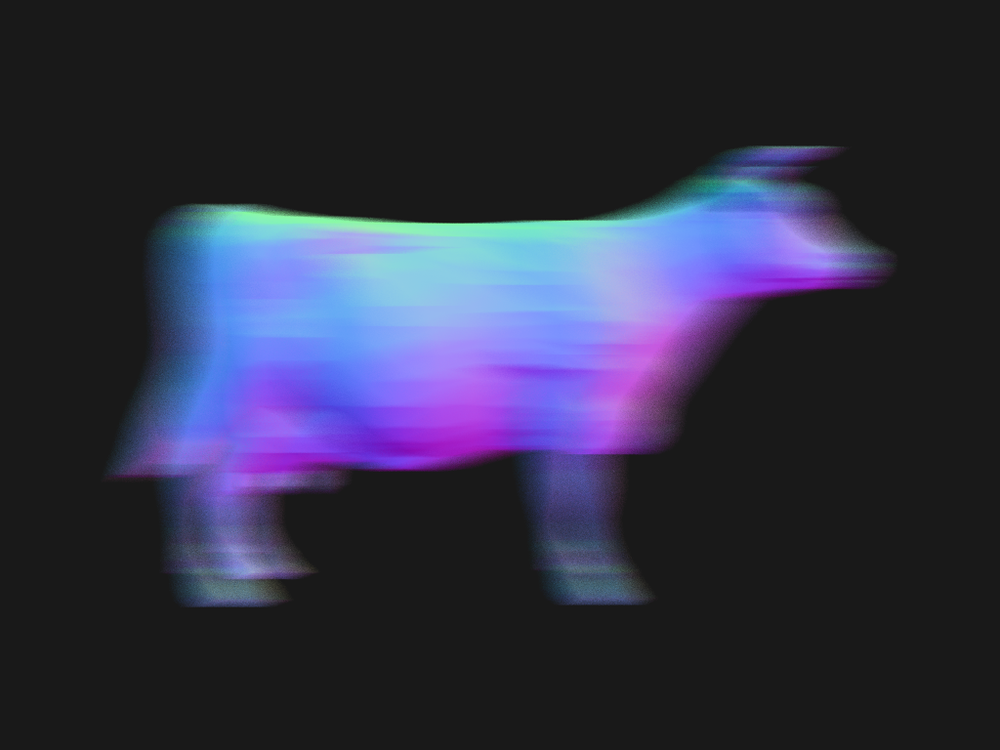
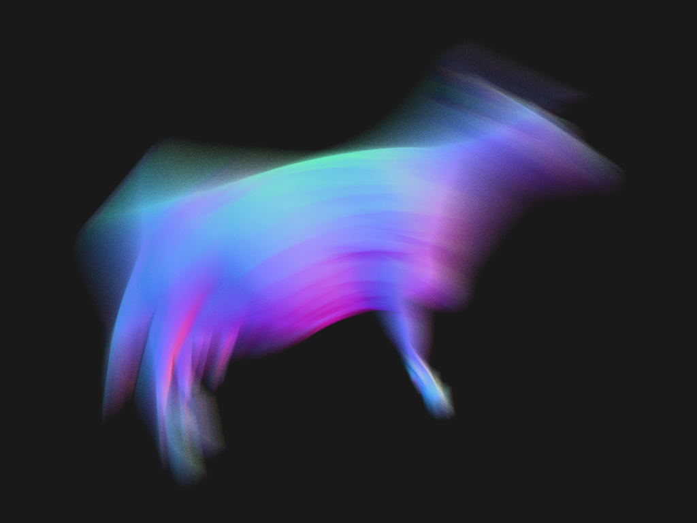
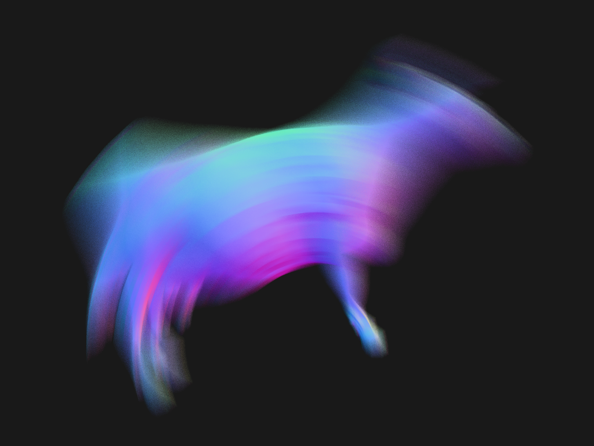
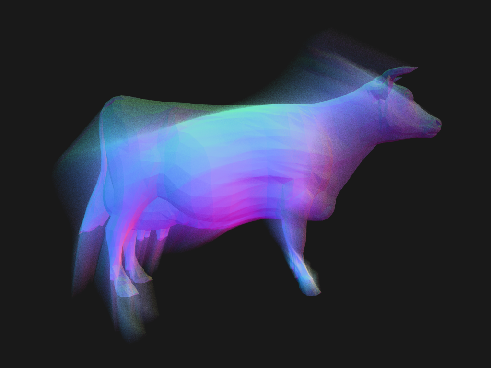
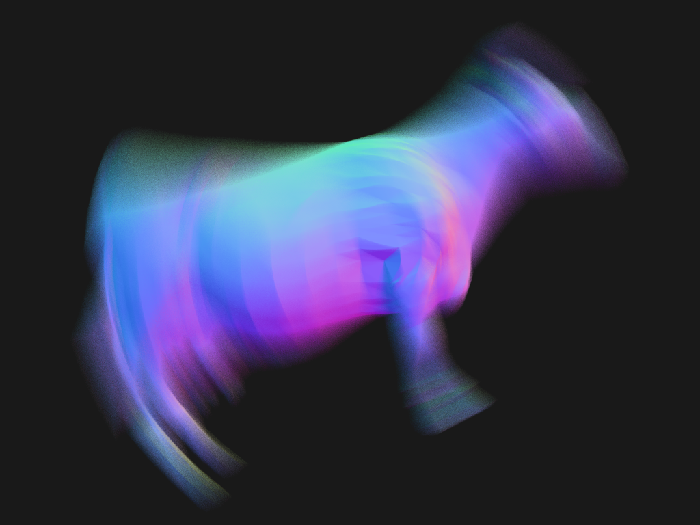
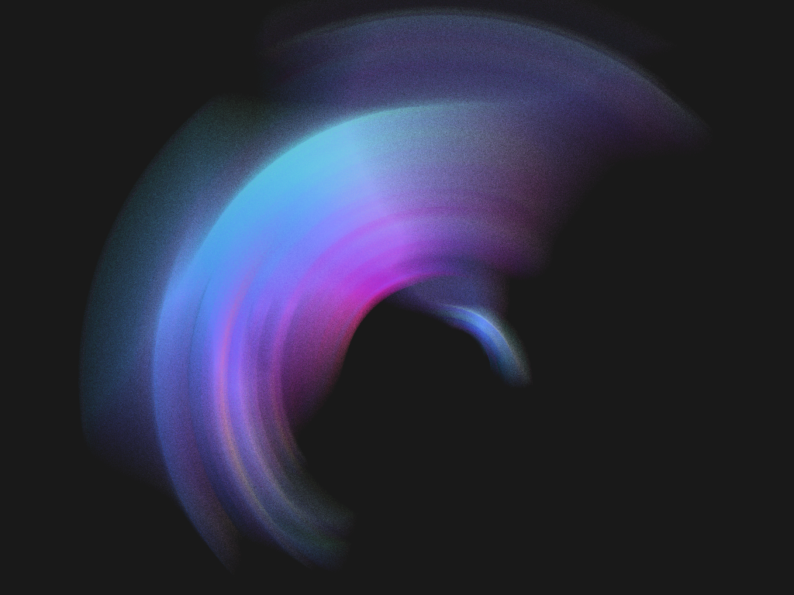

optixMotionBlur sample
======================

Shows basic transform and vertex motion blur, with animation controlled by command line args.  The raygen program selects a random time in [0,1] per ray.

The default is to build a scene with matrix transforms.  Use the "-t" argument to change this: "-t vertex" to switch to vertex deformation, or "-t srt" to switch to SRT transforms.

Examples:

1. Default translation of (0.1, 0, 0) times scene scale, as matrix transform motion.
```
./bin/optixMotionBlur
```



2. Rotation by 20 degrees about Z axis
```
./bin/optixMotionBlur --rotate 0 0 1 20
```



3. Multi-segment rotation with 4 keys (3 segments)
```
./bin/optixMotionBlur --rotate 0 0 1 20 --motion-steps 4
```



4. Start rotating at time 0.3 rather than shutter open (0.0)
```
./bin/optixMotionBlur --rotate 0 0 1 20 --motion-range 0.3 1.0
```



5. Combine rotation and translation.  Order of operations is scale,rotate,translate, flattened into a single matrix per time key.
```
./bin/optixMotionBlur --translate 0.1 0 0 --rotate 0 0 1 20 --motion-steps 4
```



6. Rotate using SRT transform instead of default matrix transform.  Large rotation of 60 degrees shows the benefit of quaternions.
```
./bin/optixMotionBlur --rotate 0 0 1 60 -t srt
```


